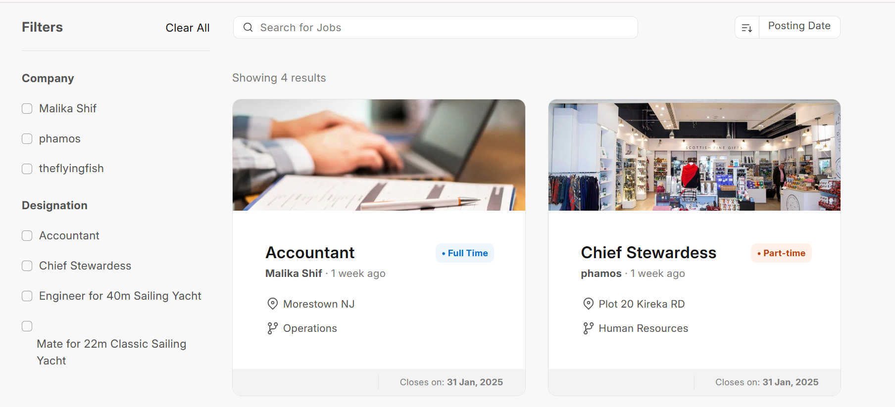
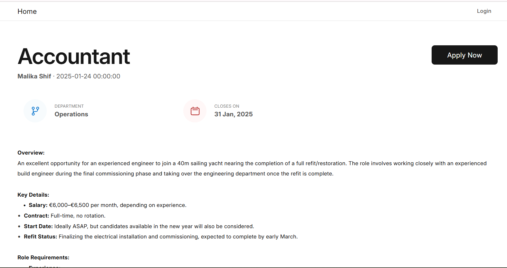

# The Flying Fish

The Flying Fish is a job listing for different companies that do marine services

## Overview



## Installation

### Frappe Cloud

You can install this from a private repository `https://github.com/theflyingfishHQ/theflyingfish`

### Local setup

1. Install Local Site, Excute the following one-by-one in a frappe bench directory
    ```
	bench get-app https://github.com/theflyingfishHQ/theflyingfish.git
    bench new-site theflyingfish.local
    bench --site theflyingfish.local install-app theflyingfish
    bench --site theflyingfish.local add-to-hosts
    ```
2. Drop Local Site
    ```
    bench drop-site theflyingfish.local --force
    ```
3. Restore Local Site from Backup
    ```
    bench --site theflyingfish.local --force restore /path/to/downloaded-site-backup-file/
    ```
## Documentation
The comprehensive documentation can be found at https://theflyingfish.phamos.eu/


## License

MIT